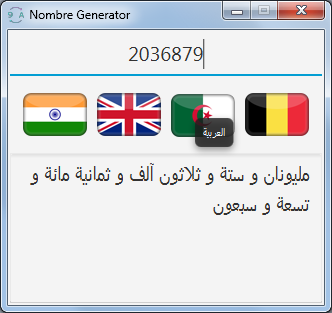
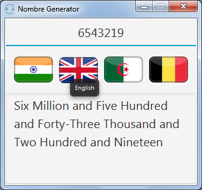
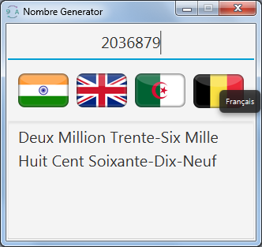
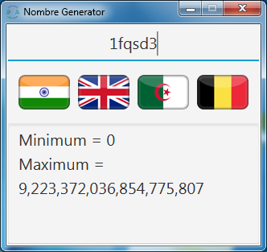

# Numbre To Lettre
This is simple java console based app  
that take as input Long number and  
GENERATE suite of lettre 

Hint
----
* input must be in this intervalle : [0, Long.MAX_VALUE]
* you can switch ON/OFF colored output from ToggleColor()
* Generate into three languages Arabic, English, Frensh

User Interface
--------------

notice this project is open for any contribution
